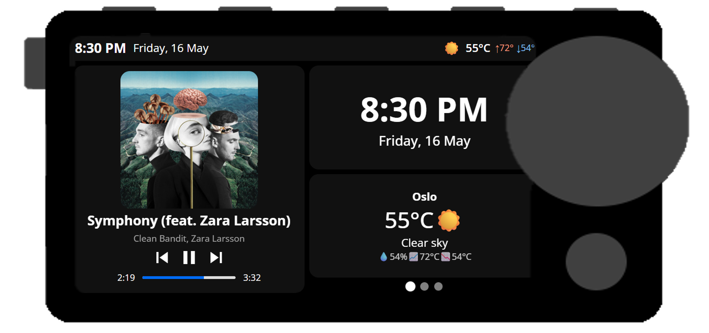
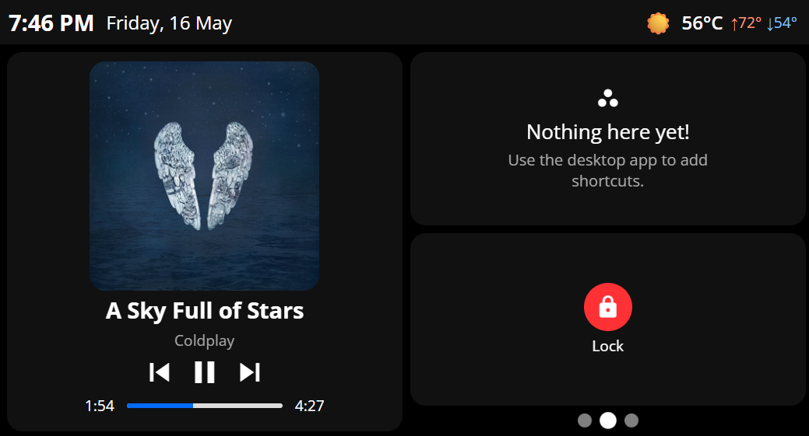
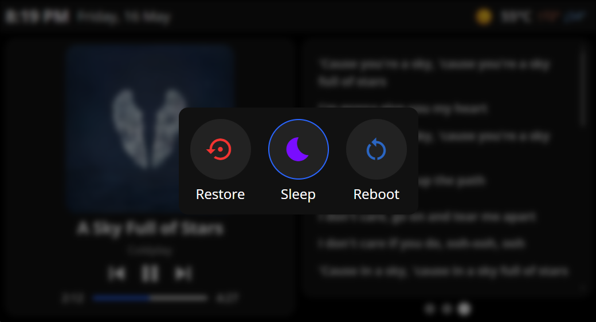
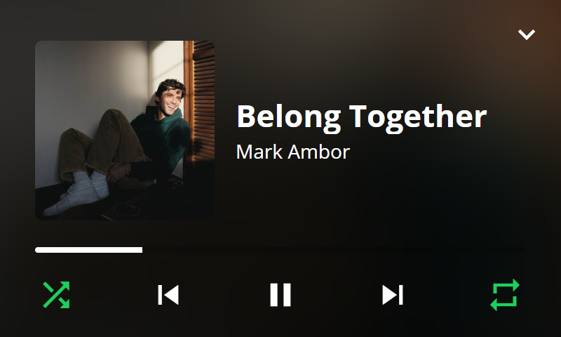
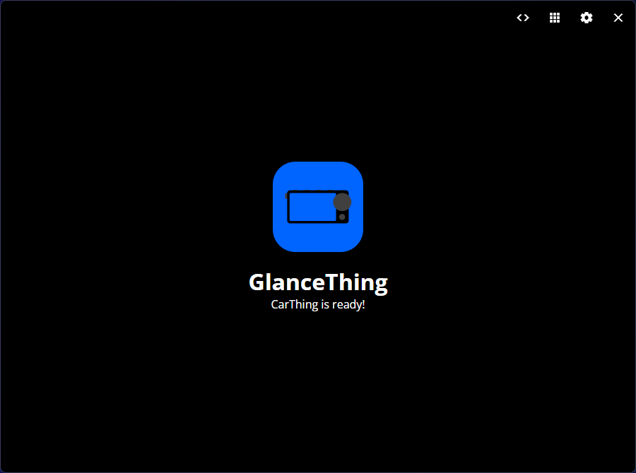
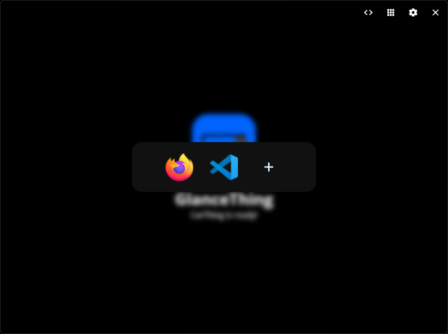
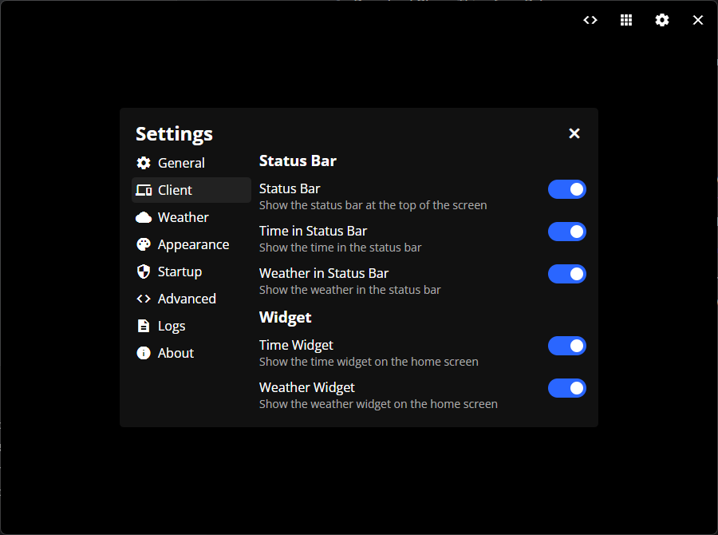
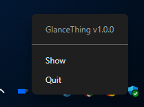

# GlanceThing

Your CarThing as a glanceable action pad!

## Features

- Desktop companion app with a guided installer

- Status bar with date and time
- Spotify controls (play/pause, volume)
- Customizable shortcuts to apps
- Command actions (will be customizable in the future)

## Getting started

The application only works on Windows and Mac for now. Linux support is planned!

1. Download GlanceThing from [Releases](../../releases/).
2. Open the downloaded file to install
3. Open the GlanceThing desktop companion and follow the instructions to set up your CarThing!

## Usage

### Client interface

Here you will see your current Spotify player status, as well as your app shortcuts and custom actions. You can use the touch screen, but the interface can also be fully navigated using the physical buttons, which is preferred.

The buttons 1, 2 and 3 (from the left) will focus the Spotify, shortcuts and actions widgets respectively.

Pressing the M button (right-most button) will bring up the system menu where you can choose to put your device to sleep, or restore your device to the original Spotify software.

Using the dial will:

- **Spotify widget**:

  - Click: Play/Pause playback.
  - Scroll: Adjust volume on the playing device

- **Shortcuts / Actions**:
  - Click: Execute highlighted action.
  - Scroll: Scroll between items, wraps around.

You can also use the album cover as a playback controller. Press once to play/pause, twice to skip forward and three times to skip backwards.

Pressing the Back button (below the dial) reveals a fullscreen media player, which can be used with the same controls as the Spotify widgets, as well as extra tappable buttons like shuffle and repeat. Press the back button again or the arrow down icon to close.

### Desktop companion

Here you will get status messages if your CarThing isn't detected, or if GlanceThing isn't installed. You can easily run setup again, or adjust settings to automatically install GlanceThing

### Shortcuts Editor

Here you can easily edit your application shortcuts, and visualize how they will look. You can add up to 8 shortcuts here, and you will be able to scroll through them on your CarThing.

You can add new shortcuts by clicking the + button, choosing an icon and selecting the command to run. [Here's how you can find the correct commands for any app.](https://github.com/BluDood/GlanceThing/wiki/Making-application-shortcuts)

### Settings

Here you can adjust how the app behaves. You can choose if the GlanceThing desktop companion will automatically start with your computer, whether it will start minimized to the system tray, and whether it will attempt to automatically install GlanceThing to your CarThing once it's detected. You can also adjust some settings that will reflect in the GlanceThing client, for example brightness and date/time format.

### Tray icon

GlanceThing will for the most part live in your system tray. Right-click it to bring up the menu, where you can open or quit GlanceThing. You can also just click the tray icon once to open GlanceThing.

## Support

If you need any help with GlanceThing or the CarThing in general, don't hesitate to ask! You can either submit issues here, join [my discord server](https://discord.bludood.com) or join the [Thing Labs discord server](https://discord.gg/car-thing-hax-community-1042954149786046604).

## Credits

Huge thanks to the [CarThing community](https://discord.gg/car-thing-hax-community-1042954149786046604) for feedback and thoughts, and special thanks to [Riprod](https://itsriprod.com/) and their [DeskThing](https://github.com/ItsRiprod/DeskThing) project for inspiration.

The project also mainly utilizes the following technologies:

**Desktop Companion**

- Electron Vite toolkit
- TypeScript
- React TSX + React Router
- ws
- axios
- party.js

**Client**

- React + Vite
- axios
